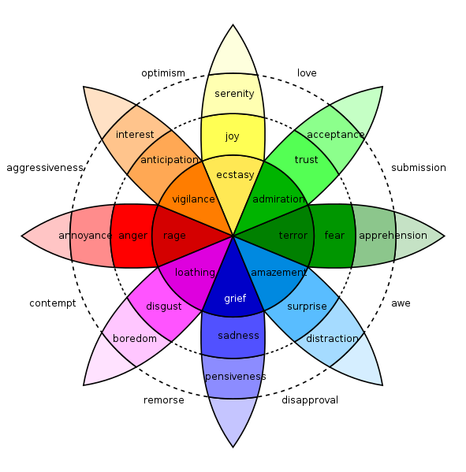

# SOTA - Multimodal Emotion Recognition

**Main Contributions:**

:white_check_mark: State-of-the-art of databases used in **Multimodal Emotion Recognition** and comprised at least the visual and vocal modalities. 

:white_check_mark: Focus on the representation of **ambiguity in emotional models** for each database. We define emotional ambiguity as the difficulty for humans to identify, express and recognize an emotion with certainty.

**README Structure:**

1. [Emotional Models](#Emotional-Models): Brief summary of the discrete and continuous emotion representation
2. [Databases with Discrete Emotions](#Databases-with-Discrete-Emotions): General description and position with respect to the representation of emotional ambiguity
3. [databases with continuous emotions](#Databases-with-Continuous-Emotions): General description and position with respect to the representation of emotional ambiguity

## Emotional Models

:link: **Anchor Links:**
1. [Discrete Model](#Discrete-Model): Description of discrete emotions and the main representations
2. [Continuous Model](#Continuous-Model): Description of continuous emotions and the main representations

### Discrete Model

Emotions are represented by discrete affective states. This approach is the most natural way for humans to define their own emotions. According to the evolutionary perspective, there are two main categories of emotions: 

* **Primary emotions**: these are innate and universal emotions, short-lived and quickly triggered in response to an emotional stimulus. The list of primary emotions varies greatly depending on the discipline and the author. The most common ones are: 

  * The six primary emotions of Ekman (1992): fear, anger, joy, sadness, disgust and surprise. 

  * Plutchik (2001)'s wheel of emotions with eight primary emotions grouped into four pairs of opposing emotions: joy and sadness, confidence and disgust, fear and anger, anticipation and surprise. 

  
  

  

  

  
  
 
  Plutchik's wheel of emotions
  

* **Secondary emotions**: these are derived from the feelings of the primary emotions, are acquired through learning and confrontation with reality, and are culture-dependent. As an example, after feeling anger, we may then feel shame or guilt. Secondary emotions are usually combinations of primary emotions (Nugier et al., 2009).

Primary emotions are frequently chosen as classes for the development of recognition models, thus avoiding a possible overlap of emotional states. Although the discrete approach remains widely favoured in research due to its intelligibility, limiting oneself to the recognition of a primary emotion is not sufficient to describe the whole spectrum of emotions.

[Go to top](##SOTA---Multimodal-Emotion-Recognition) :top:

### Continuous Model

Emotions are placed in a multidimensional space. A large majority of researchers working on the continuous model agree on the two following dimensions:

* **Valence** corresponds to the pleasantness of the emotion. For example, disgust is an unpleasant emotion and is therefore associated with a negative valence. In contrast, a positive valence is related to a pleasant emotion such as joy.

* **Activation** refers to the physiological intensity felt. Sadness, which leads to withdrawal, is associated with low activation. Anger activation is high because it releases an influx of energy that allows the individual to prepare for battle. 

 These two dimensions are not sufficient to characterize the emotion (e.g. both anger and fear have a negative valence and high activation). However, the third dimension does not create a consensus in the research. According to Russell et Mehrabian (1977), it could correspond to **control**. Thus, an angry individual feels in control of the situation (positive control) while a person overwhelmed by sadness seems to see the situation slipping away (negative control). The resulting model is called PAD (Pleasure, Arousal, Dominance) and is sufficient to describe all emotions according to the authors.
 
  In addition to better temporal resolution, the continuous approach allows for a wide range of emotional states to be represented and for variations in these states over time to be handled (Gunes et al., 2011). These advantages have led to a growing interest in affective computing.

  
  

  

  

  
  
 
  The Pleasure-Arousal-Dominance model
  

[Go to top](##SOTA---Multimodal-Emotion-Recognition) :top:
  

## Databases with Discrete Emotions

:link: **Anchor Links:**
1. [Description of the Databases](#Description-of-the-databases---Discrete): General information of the databases that have chosen discrete emotions 
2. [Databases and Emotional Ambiguity](#Databases-and-emotional-ambiguity---Discrete): Position of the databases with respect to the representation of emotional ambiguity

:information_source: Databases marked with a * offer discrete and continuous representation of emotions.

### Description of the Databases - Discrete

Name | Year | Language | Modalities | Classes | Number sentences | Description
-----|------|----------|------------|---------|-----------------------|------------ 
 [CMU-MOSEAS](https://github.com/A2Zadeh/CMU-MultimodalSDK) ([paper](https://www.ncbi.nlm.nih.gov/pmc/articles/PMC8106386/)) | 2020 | French, Spanish, Portuguese, German | Vocal, Visual, Textual | Happiness, Anger, Sadness, Fear, Disgust, Surprise | 10000 per language | Monologue videos from YouTube. High diversity of topics covered by a large number of speakers. Annotations on sentiments, emotions, subjectivity and 12 personality traits. Each emotion annotated on a [0,3] Likert scale for its degree of presence.
 [CMU-MOSEI](https://github.com/A2Zadeh/CMU-MultimodalSDK) ([paper](https://aclanthology.org/P18-1208.pdf)) | 2018 | English | Vocal, Visual, Textual | Happiness, Anger, Sadness, Fear, Disgust, Surprise | 23453 | Monologue videos from YouTube. High diversity of topics covered by a large number of speakers. Annotations on emotions and sentiments. Each emotion annotated on a [0,3] Likert scale for its degree of presence.
 [OMG-Emotions](https://github.com/knowledgetechnologyuhh/OMGEmotionChallenge)* ([paper](https://ieeexplore.ieee.org/abstract/document/8489099)) | 2018 | English | Vocal, Visual, Textual | Happiness, Anger, Sadness, Fear, Disgust, Surprise, Neutral | 2400 | Monologue videos from YouTube. Uses gradual annotations with a focus on contextual emotion expressions.
 [MELD](https://affective-meld.github.io/) ([paper](https://arxiv.org/pdf/1810.02508.pdf)) | 2018 | English | Vocal, Visual, Textual | Happiness, Anger, Sadness, Fear, Disgust, Surprise, Neutral | 13708 | Clips from the TV series Friends. One of the largest databases involving more than two people in a conversation.
 [IEMOCAP](https://sail.usc.edu/iemocap/iemocap_release.htm)* ([paper](https://link.springer.com/article/10.1007/s10579-008-9076-6)) | 2008 | English | Vocal, Visual, Textual, Markers on face, head and hand | Happiness, Anger, Sadness, Neutral, Frustration | 10039 | Emotions are played out by professional actors. Widely used in affective computer research.

  [Go to top](##SOTA---Multimodal-Emotion-Recognition)

### Databases and Emotional Ambiguity - Discrete

Name | Year | Final annotation | \# annotations per sentence | Aggregation of annotations
-----|------|------------------|------------------------------------|--------------------------
 [CMU-MOSEAS](https://github.com/A2Zadeh/CMU-MultimodalSDK) | 2020 | Many emotions possible per sentence | 3 | Not reported
 [CMU-MOSEI](https://github.com/A2Zadeh/CMU-MultimodalSDK) | 2018 | Many emotions possible per sentence | 3 | Not reported
 [OMG-Emotions](https://github.com/knowledgetechnologyuhh/OMGEmotionChallenge)* | 2018 | One emotion per sentence | 5 | Majority vote
 [MELD](https://affective-meld.github.io/) | 2018 | One emotion per sentence | 3 | Majority vote
 [IEMOCAP](https://sail.usc.edu/iemocap/iemocap_release.htm)* | 2008 | One emotion per sentence | 3 | Majority vote

  [Go to top](##SOTA---Multimodal-Emotion-Recognition) :top:

## Databases with Continuous Emotions

:link: **Anchor Links:**
1. [Description of the Databases](#Description-of-the-databases---Continuous): General information of the databases that have chosen continuous emotions
2. [Databases and Emotional Ambiguity](#Databases-and-emotional-ambiguity---Continuous): Position of the databases with respect to the representation of emotional ambiguity

:information_source: Databases marked with a * offer discrete and continuous representation of emotions.

### Description of the Databases - Continuous

Name | Year | Language | Modalities | Dimensions | Number sentences | Description
-----|------|----------|------------|---------|-----------------------|------------ 
 [MuSe-CaR](https://zenodo.org/record/4651164#.YKUmHqE69hE) ([paper](https://dl.acm.org/doi/abs/10.1145/3423327.3423673)) | 2021 | English | Vocal, Visual, Textual | Valence, Activation, Trustworthiness | 28295 | Car reviews from YouTube. In-the-wild characteristics (e.g. reviewer visibility, ambient noises, domain-specific terms). Designed for sentiment recognition, emotion-target engagement and trustworthiness detection.
 [SEWA](https://db.sewaproject.eu/) ([paper](https://ieeexplore.ieee.org/abstract/document/8854185)) | 2019 | English, German, Hungarian, Greek, Serbian, Chinese | Vocal, Visual, Textual | Valence, Activation, Liking | 538[^SEWA] | Ordinary people from the same culture discuss advertisements via video conference. Database created for emotion recognition but also for human behavior analysis, including cultural studies.
 [OMG-Emotions](https://github.com/knowledgetechnologyuhh/OMGEmotionChallenge)* ([paper](https://ieeexplore.ieee.org/abstract/document/8489099)) | 2018 | English | Vocal, Visual, Textual | Valence, Activation | 2400 | Monologue videos from YouTube. Uses gradual annotations with a focus on contextual emotion expressions.
 [RECOLA](https://diuf.unifr.ch/main/diva/recola/download.html) ([paper](https://drive.google.com/file/d/0B2V_I9XKBODhNENKUnZWNFdVXzQ/view?resourcekey=0-pkUwtWY7x82Gw5zurnQNag)) | 2013 | French | Vocal, Visual, ECG[^ECG], EDA[^EDA] | Valence, Arousal | 3,8 hours[^no-info] | Online dyadic interactions where participants need to collaborate to solve a survival task. Mood Induction Procedure to elicit emotion.
 [SEMAINE](https://ieeexplore.ieee.org/abstract/document/5959155) ([paper](https://ieeexplore.ieee.org/abstract/document/8489099)) | 2012 | English | Vocal, Visual, Textual | Valence, Arousal, Dominance, Power, Intensity | 190 videos[^no-info] | Volunteers interact with an artificial character to which a personality trait has been assigned (angry, happy, gloomy, sensible).
[IEMOCAP](https://sail.usc.edu/iemocap/iemocap_release.htm)* ([paper](https://link.springer.com/article/10.1007/s10579-008-9076-6)) | 2008 | English | Vocal, Visual, Textual, Markers on face, head and hand | Valence, Arousal, Dominance | 10039 | Emotions are played out by professional actors. Widely used in affective computer research. 
[VAM](https://sail.usc.edu/VAM/vam_release.htm) ([paper](https://ieeexplore.ieee.org/abstract/document/4607572)) | 2008 | German | Vocal, Visual | Valence, Arousal, Dominance | 1018 | Videos from a German TV talk show: spontaneous emotions from unscripted discussion.

[^SEWA]: The paper does not specify whether it is all languages combined or a specific language.
[^ECG]: Electrocardiogram
[^EDA]: Electrodermal Activity
[^no-info]: No information provided on the number of annotated sentences. 

[Go to top](##SOTA---Multimodal-Emotion-Recognition) :top:

### Databases and Emotional Ambiguity - Continuous

Name | Year | Final annotation | \# annotations per sentence | Aggregation of annotations
-----|------|------------------|------------------------------------|--------------------------
 [MuSe-CaR](https://zenodo.org/record/4651164#.YKUmHqE69hE) | 2021 | Point in the emotional space | 5 | Evaluator Weighted Estimator
 [SEWA](https://db.sewaproject.eu/) | 2019 | Point in the emotional space | At least 3 | Canonical Time Warping
 [OMG-Emotions](https://github.com/knowledgetechnologyuhh/OMGEmotionChallenge)* | 2018 | Point in the emotional space | 5 | Evaluator Weighted Estimator
 [RECOLA](https://diuf.unifr.ch/main/diva/recola/download.html) | 2013 | Point in the emotional space | 6 | Mean Filtering
 [SEMAINE](https://ieeexplore.ieee.org/abstract/document/5959155) | 2012 | Point in the emotional space | From 3 to 8 | Not reported
 [IEMOCAP](https://sail.usc.edu/iemocap/iemocap_release.htm)* | 2008 | Single element from SAM[^SAM] | 2 | Z-normalisation
 [VAM](https://sail.usc.edu/VAM/vam_release.htm) | 2008 | Single element from SAM[^SAM] | From 6 to 17 (audio) ; From 8 to 34 (face) | Not reported 

 [^SAM]: SAM for [Self-Assessment Manikins](https://www.sciencedirect.com/science/article/abs/pii/0005791694900639)

 [Go to top](##SOTA---Multimodal-Emotion-Recognition) :top:

 ## References
 Ekman, P. (1992). An Argument for Basic Emotions. *Cognition & Emotion 6*(3-4), 169–200.

 Gunes, H., B. Schuller, M. Pantic, et R. Cowie (2011).  Emotion representation, analysis andsynthesis in continuous space : A survey.  In *2011 IEEE International Conference on Automatic Face & Gesture Recognition (FG)*, pp. 827–834. IEEE.

 Nugier, A. (2009). Histoire et grands courants de recherche sur les émotions. *Revue électronique de Psychologie Sociale 4*(4), 8–14

 Plutchik, R. (2001). The Nature of Emotions : Human emotions have deep evolutionary roots, a fact that may explain their complexity and provide tools for clinical practice. *American Scientist 89*(4), 344–350.

 Russell,  J.  A.  et  A.  Mehrabian  (1977).   Evidence  for  a  Three-Factor  Theory  of  Emotions. *Journal of Research in Personality 11*(3), 273–294